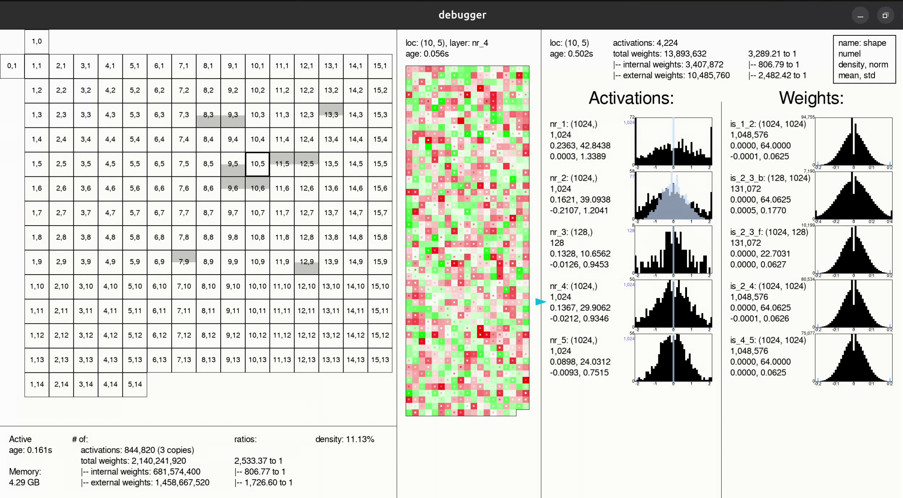
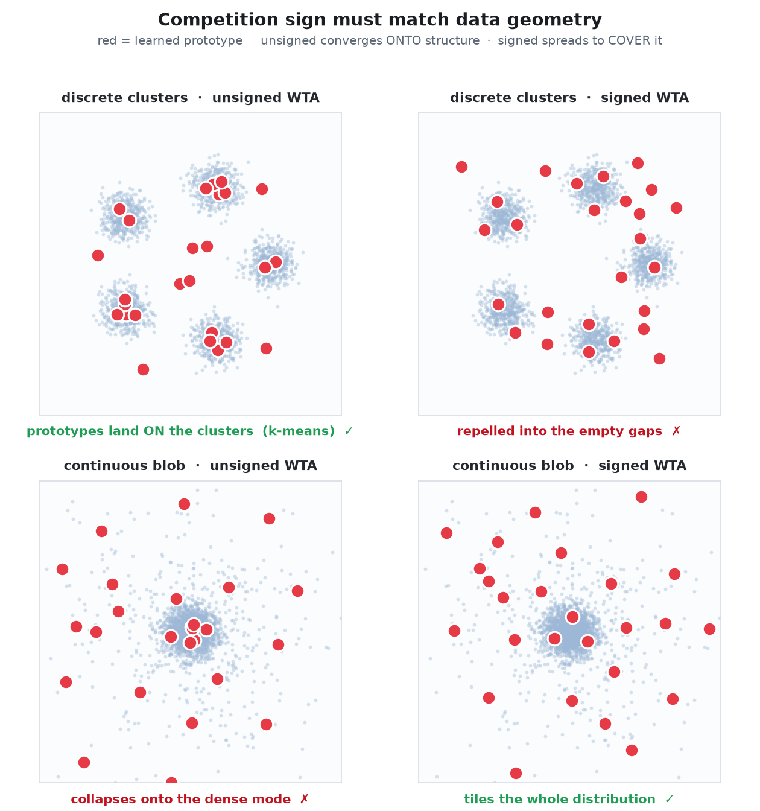

# gc

<p align="center">
	
</p>

Objective-free, modular, feedback neural networks that learn via association.

(*Disclaimer: Very rough/early/speculative work*)

## Install and Run

Install `pyproject.toml` (using `pip`, `uv`, or whatever).

Run the main network:
```
python main.py
```
This should open a debugger GUI window. Closing the debugger (or Ctrl + C) will stop and save the network.

To load and run a save (fresh runs append a timestamp to the save directory, so use the actual name from `saves/`):
```
python main.py --load "saves/main_agt-<timestamp>"
```

Choose the size of the network:
```
python main.py --size 100
```

To view a saved network without running it:
```
python view_only.py "saves/main_agt-<timestamp>"
```

Run an example:
```
python examples/00_debug_learning_rule.py
```

Run the smaller testing network:
```
python simple_nets.py
```

## Using the Debugger GUI

- The grid of cells on the left hand side shows the modules within the network.
- Left click on a square in the grid to see:
	- Activations and weights, on the right side
	- Outgoing connections, as gray rectangles on the grid
- Then right click to select an outgoing connection or an activation layer, to see detailed information in the middle pane.
- Press Esc or click off the grid to clear.

## Current Results

### MNIST

MNIST using the BCM (Bienenstock–Cooper–Munro) rule learns (rescues the representations compared to the frozen baseline) but doesn't even beat the raw image.

| @ 5000 steps                     | kNN  | Ridge  | Linear |
| -------------------------------- | ---- | ------ | ------ |
| gc no learning (frozen baseline) | 83.9 | 79.0   | 80.6   |
| gc (BCM rule)                    | 84.3 | 81.9   | 82.8   |
|                                  |      |        |        |
| the raw images                   | 84.5 | 77.9   | 84.4   |
|                                  |      |        |        |
| MLP using gradient descent       | much | higher | (90s)  |
| CNN                              | not  | even   | close  |

(see `examples/05_mnist_all_probes.py`)

### CIFAR

CIFAR-10/100 using online Oja softmax-WTA (winner-take-all) does actually learn. Basically using SoftHebb (Moraitis et al., arXiv:2209.11883) adapted for online, and without the ad hoc tricks.

|                                  |      | CIFAR-10 |        |     |      | CIFAR-100 |        |
| -------------------------------- | ---- | -------- | ------ | --- | ---- | --------- | ------ |
|                                  | kNN  | Ridge    | Linear |     | kNN  | Ridge     | Linear |
| the raw images                   | 34.8 | 26.9     | 25.4   |     | 9.6  | 6.5       | 7.8    |
|                                  |      |          |        |     |      |           |        |
| gc no learning                   | 44.3 | 57.1     | 57.7   |     | 15.1 | 23.7      | 20.1   |
| gc online 200k steps (4 epochs)  | 49.5 | 64.2     | 61.9   |     | 17.5 | 31.0      | 23.8   |
|                                  |      |          |        |     |      |           |        |
| SoftHebb no learning             | 43.2 | 53.8     | 53.4   |     | 15.8 | 25.3      | 18.1   |
| SoftHebb online 200k             | 47.7 | 59.6     | 58.9   |     | 18.0 | 23.6      | 24.0   |
| SoftHebb tuned full training run |      |          | 79.9   |     |      |           |        |

(see `examples/{08_cifar10, 09_cifar100}.py`)

### Abstract Data

Abstract clustered vectors (Gaussian blobs in a noisy high-dim space — *data*, not images) genuinely learn under online softmax-WTA, reaching most of the way to the oracle (kNN on the true signal dimensions). The catch is the **sign**, which must match the data's geometry: discrete clusters want **unsigned** WTA (pure competition, ≈ online k-means); the continuous image manifolds above want **signed** WTA (anti-Hebbian repulsion, à la SoftHebb).

<p align="center">
	
</p>

*2-D illustration: unsigned WTA converges **onto** structure, signed spreads to **cover** it — the right sign is whichever the geometry needs.*

The rule barely matters once WTA is in place — Oja and instar stay within a point or two: Oja gives the clean number (93.1), instar the noisy one (50.5, helped by a per-activation adaptive learning rate when the signal is weak). BCM trails both and ignores the sign.

| kNN %                    | clean | noisy |
| ------------------------ | ----- | ----- |
| the raw vector           | 66.0  | 32.3  |
| gc no learning (frozen)  | 74.2  | 26.5  |
| gc online unsigned WTA   | 93.1  | 50.5  |
| oracle (signal subspace) | 95.7  | 58.7  |

(see `examples/{10_one_layer_clean, 11_one_layer_noisy}.py`)

## Files

```
# Main networks
src/
├── funcs.py     # Functions used in agents
├── agents.py    # Main neural nets file
├── iotypes.py   # Input and output types
├── envs.py      # Virtual environments or software interfaces to the real world
└── debugger.py  # Debugger GUI
main.py
view_only.py
examples/
└── XX_<name>.py

# Smaller neural nets for testing
simple/          
├── funcs.py
├── agents.py
└── debugger.py
simple_nets.py
```

## Memory

Intended for scalability, currently:
- **16 bytes** per activation (can be much more generous),
- and the standard **2 bytes** per weight.

## References

- **Neuroscience: Exploring the Brain** (2016); M. F. Bear, B. W. Connors, M. A. Paradiso
- **Theoretical Neuroscience: Computational And Mathematical Modeling of Neural Systems** (2001); P. Dayan, L. F. Abbot
- **Beyond Reward and Punishment** (2019); D. Deutsch
- **Diaspora** (1997); G. Egan
- **A Path Towards Autonomous Machine Intelligence** (2022); Y. LeCun
- **Active Inference: The Free Energy Principle in Mind, Brain, and Behavior** (2022); T. Parr, G. Pezzulo, K. J. Friston
- **The Book of Why: The New Science of Cause and Effect** (2018); J. Pearl, D. Mackenzie
- **Conjectures and Refutations: The Growth of Scientific Knowledge** (1963); K. Popper
- **The Alberta Plan for AI Research** (2022); R. S. Sutton, M. Bowling, P. M. Pilarski

## Methods and Goals

"Reinforcement learning without reward"

"Knowledge without authority"

"Completely unsupervised learning"

"Total freedom"

| (nothing necessarily against these, just not the goals of this project) |                                                |
| ----------------------------------------------------------------------- | ---------------------------------------------- |
| ❌ Gradient descent                                                      | ✔️ Hebbian association                         |
| ❌ Learn by obeying training data                                        | ✔️ Learn by variation & selection of ideas     |
| ❌ Reward                                                                | ✔️ Interact with environments *without* reward |
| ❌ Top-down control                                                      | ✔️ Bottom-up cooperation and competition       |
| ❌ Predict data                                                          | ✔️ Understand the world                        |
| ❌ Training and deployment                                               | ✔️ Life                                        |
| ❌ Fulfill specified objectives                                          | ✔️ Open ended progress                         |
| ❌ AI safety by subservience to humans                                   | ✔️ AI safety by individual freedom             |
| ❌ AIs that are tools                                                    | ✔️ AIs who are people                          |

## Roadmap

Right now it kind of sucks, need to make it "actually be good":
- Learn useful representations
	- Of perceptual input, goals, and actions
	- Models of self, other agents, and the world
	- Language
	- Abstract ideas
- Interact intelligently with environments
	- Explore and learn
	- Plan and pursue goals
- Think and be creative 😬

---

**gc**
1. **g**eneral intelligence / **c**reativity
2. George Carlin
