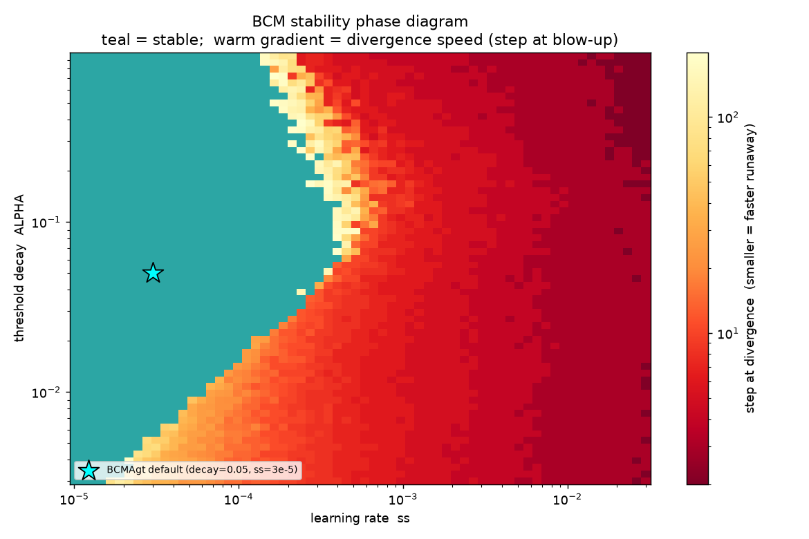

## Current Results

### MNIST

MNIST using the BCM (Bienenstock-Cooper-Munro) rule learns (rescues the representations compared to the frozen baseline) but doesn't even beat the raw image.

| @ 5000 steps                     | kNN  | Ridge  | Linear |
| -------------------------------- | ---- | ------ | ------ |
| gc no learning (frozen baseline) | 83.9 | 79.0   | 80.6   |
| gc (BCM rule)                    | 84.3 | 81.9   | 82.8   |
|                                  |      |        |        |
| the raw images                   | 84.5 | 77.9   | 84.4   |
|                                  |      |        |        |
| MLP using gradient descent       | much | higher | (90s)  |
| CNN                              | not  | even   | close  |

(see `examples/05_mnist_all_probes.py`)

### BCM stability

BCM is potentiation-dominated (roughly cubic in activity) and self-stabilizes only through its sliding threshold `θ = ⟨y²⟩`. In the **recurrent** substrate this is a binding constraint: stability holds only inside a narrow band of the learning-rate (`ss`) and threshold-decay (`ALPHA`) plane, and outside it the activations run away.

	

(regenerate using `examples/08_bcm_stability.py`)

`ss` is the dominant axis (too large outruns the threshold). `ALPHA` has an *interior* optimum: too low and `θ` freezes and stops braking, too high and the homeostatic loop over-corrects. Both the stable region and the `ALPHA` optimum are **architecture-dependent**: they shift with column count and connectivity, so a stable `(ss, ALPHA)` for one network is not stable for another. This knife-edge is a reason to prefer Oja-signed / SoftHebb for a recurrent substrate: its decay term bounds `‖w‖` at any learning rate, so there is no stability surface to tune.

### CIFAR

CIFAR-10/100 using online Oja softmax-WTA (winner-take-all) does actually learn. Basically using SoftHebb (Moraitis et al., arXiv:2209.11883) adapted for online, and without the ad hoc tricks.

|                                  |      | CIFAR-10 |        |     |      | CIFAR-100 |        |
| -------------------------------- | ---- | -------- | ------ | --- | ---- | --------- | ------ |
|                                  | kNN  | Ridge    | Linear |     | kNN  | Ridge     | Linear |
| the raw images                   | 34.8 | 26.9     | 25.4   |     | 9.6  | 6.5       | 7.8    |
|                                  |      |          |        |     |      |           |        |
| gc no learning                   | 44.3 | 57.1     | 57.7   |     | 15.1 | 23.7      | 20.1   |
| gc online 200k steps (4 epochs)  | 49.5 | 64.2     | 61.9   |     | 17.5 | 31.0      | 23.8   |
|                                  |      |          |        |     |      |           |        |
| SoftHebb no learning             | 43.2 | 53.8     | 53.4   |     | 15.8 | 25.3      | 18.1   |
| SoftHebb online 200k             | 47.7 | 59.6     | 58.9   |     | 18.0 | 23.6      | 24.0   |
| SoftHebb tuned full training run |      |          | 79.9   |     |      |           |        |

(see `examples/{09_cifar10, 10_cifar100}.py`)

### Abstract Data

Abstract clustered vectors (Gaussian blobs in a noisy high-dim space, *data* rather than images) learn under online softmax-WTA, reaching most of the way to the oracle (kNN on the true signal dimensions). The catch is the **sign**, which must match the data's geometry: discrete clusters want **unsigned** WTA (pure competition, ≈ online k-means); the continuous image manifolds above want **signed** WTA (anti-Hebbian repulsion, like SoftHebb).

	

*Unsigned WTA converges **onto** structure, signed spreads to **cover** it; the right sign is whichever the geometry needs. Regenerate diagram using `examples/13_wta_geometry.py`.*

The rule barely matters once WTA is in place. Oja and instar stay within a point or two: Oja gives the clean number (93.1), instar the noisy one (50.5, helped by a per-activation adaptive learning rate when the signal is weak). BCM trails both and ignores the sign.

| kNN %                    | clean | noisy |
| ------------------------ | ----- | ----- |
| the raw vector           | 66.0  | 32.3  |
| gc no learning (frozen)  | 74.2  | 26.5  |
| gc online unsigned WTA   | 93.1  | 50.5  |
| oracle (signal subspace) | 95.7  | 58.7  |

(see `examples/{11_one_layer_clean, 12_one_layer_noisy}.py`)

### Expectations (Dir.E)

#### One Layer

A one-hidden-layer feedforward agent with Dir.A running forward (SoftHebb) and Dir.E running backward: a map from hidden activity at t-1 to input at t, trained by the delta rule (Hebbian in form, error-valued). Guesses are published before each input arrives, then scored by cosine. Structure gets found where it exists (a 4-symbol cycle), nothing gets claimed where it doesn't (fresh noise each step). Canonical temporal predictive coding and a wake-sleep Helmholtz machine run alongside as references.

| mean trailing score | cycle | noise | retention | resettle       |
| ------------------- | ----- | ----- | --------- | -------------- |
| dir.e on            | +1.00 | -0.00 | +0.78     | 64 vs 82 steps |
| predictive coding   | +1.00 | -0.00 | +0.25     | 262 vs 57      |
| wake-sleep          | +1.00 | +0.01 | +0.94     | 50 vs 53       |
| dir.e off           | -0.02 | +0.02 |           |                |
| frozen twin         | +0.01 | +0.02 |           |                |
| copy-last null      | -0.00 | -0.00 |           |                |

Prediction doesn't separate the learners; the noise sandwich (cycle -> noise -> same cycle) does. Canonical PC keeps settling-and-learning on the noise, drags its maps, and comes back at quarter strength relearning 5x slower (burnout); dir.e-on loses a fifth and relearns *faster* than it first learned (savings). The backward direction carries all of it: the same substrate with Dir.E frozen predicts nothing, so the prediction lives in the expectation pathway, not the forward features.

(see `examples/14_expectations_one_layer.py`)

#### Deep

The same expectations run through a **deep** stack of real substrate parts (I_VectorCol input, BareCol hidden layers, framework conns), with the delta rule training the backward Dir.E conns. Each one predicts the next activity of the layer below, scored per column against a persistence baseline (what copy-last would score on that column's own activity):

|              | cycle   |         |     | noise   |         |
| ------------ | ------- | ------- | --- | ------- | ------- |
|              | predict | persist |     | predict | persist |
| input (0,0)  | +1.00   | -0.00   |     | +0.00   | -0.00   |
| hidden (1,0) | +1.00   | +0.03   |     | -0.01   | +0.01   |
| top (2,0)    | (none)  | +0.47   |     | (none)  | +0.50   |

Depth costs nothing: the delta rule's credit assignment is layer-local, so every predicted column learns its cycle to 1.00. The unpredicted top column shows the catch instead: its activity is ~0.5 self-similar even on iid noise, because triangle-plus-norm dynamics turn white input into activity dominated by its own stationary statistics. iid at the input is not iid at depth, so honesty at depth means predicting no better than persistence, not predicting nothing.

(see `examples/15_expectations_deep.py`)

#### BareAgt

Recurrent grid of single-layer modules with no internal weights.

TODO
